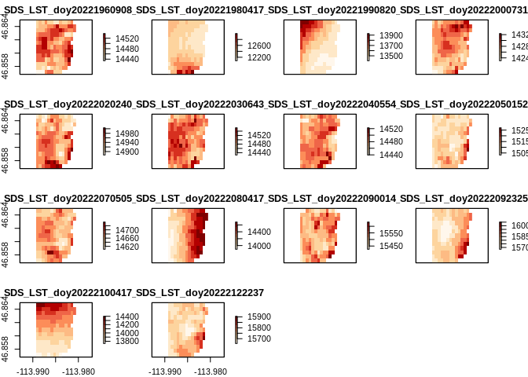
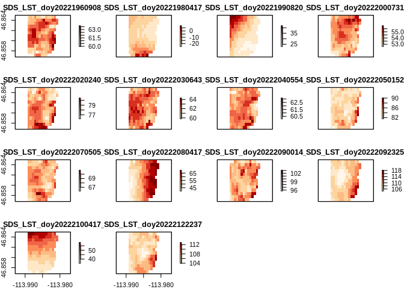
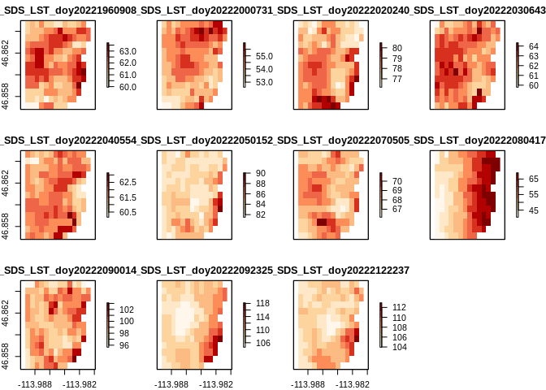
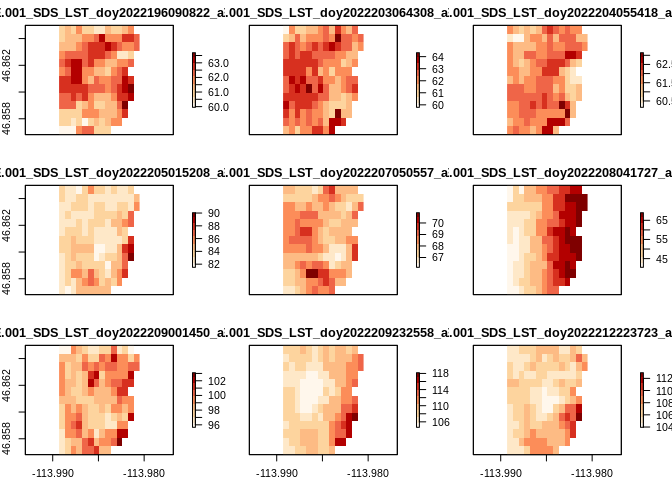
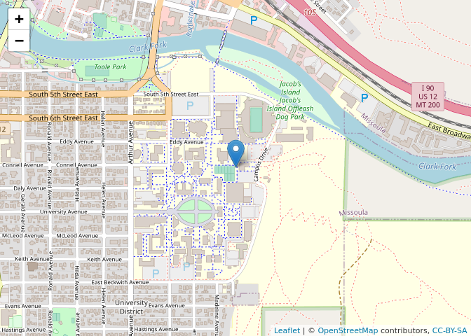
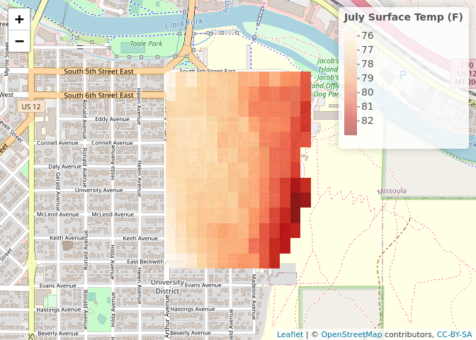

Summer Heat at the University of Montana
================
Marie Johnson
10/20/2022

## Objective

In this code we will explore summer land surface temperatures (LST) at
the University of Montana (UMT) using ECOSTRESS LST data. We’ll find the
best places to stay cool in the summer on campus!

``` r
knitr::opts_chunk$set(echo = TRUE)
knitr::opts_chunk$set(root.dir = '/home/marie/portfolio/UM')
```

``` r
# Libraries
library(raster)
```

    ## Loading required package: sp

``` r
library(tidyverse)
```

    ## ── Attaching packages ─────────────────────────────────────── tidyverse 1.3.0 ──

    ## ✓ ggplot2 3.3.5     ✓ purrr   0.3.4
    ## ✓ tibble  3.0.4     ✓ dplyr   1.0.4
    ## ✓ tidyr   1.1.2     ✓ stringr 1.4.0
    ## ✓ readr   1.4.0     ✓ forcats 0.5.0

    ## ── Conflicts ────────────────────────────────────────── tidyverse_conflicts() ──
    ## x tidyr::extract() masks raster::extract()
    ## x dplyr::filter()  masks stats::filter()
    ## x dplyr::lag()     masks stats::lag()
    ## x dplyr::select()  masks raster::select()

``` r
library(lubridate)
```

    ## 
    ## Attaching package: 'lubridate'

    ## The following objects are masked from 'package:raster':
    ## 
    ##     intersect, union

    ## The following objects are masked from 'package:base':
    ## 
    ##     date, intersect, setdiff, union

``` r
library(RColorBrewer)
library(leaflet)
```

``` r
# Import LST files
summerList <- list.files(path='/home/marie/portfolio/UM/LST/summer', full.names = T) # Raw LST file list
umShp <- shapefile('umt.shp')
```

Here you see an unexciting shapefile of the University of Montana

``` r
plot(umShp)
```

<!-- -->

``` r
# Create template raster to format LST files
tRes <- c(0.0006288207, 0.0006288207) # 70m resolution IS this 70? 0.0006288207
prj4326 <- '+proj=longlat +datum=WGS84 +no_defs +ellps=WGS84 +towgs84=0,0,0'
rstExt <- bbox(umShp)
r2 <- extent(rstExt)
rstTmp <- raster(crs=prj4326, ext=r2, resolution = tRes)
```

``` r
mskStack <- function(rastFiles, tmpRst, msk){ # rastFiles: creates from list.files, 
  require(raster)
  rastSt <- stack()
  for(i in 1:length(rastFiles)) {
    rastOut <- raster(rastFiles[i]) # read in raster from list
    prjR <- projectRaster(rastOut, tmpRst)
    rastMsk <- mask(prjR, msk)
    rastSt <- stack(rastSt, rastMsk)
  }
  rastSt
}
sLST <- mskStack(summerList, rstTmp, umShp)
```

    ## Warning in projectRaster(rastOut, tmpRst): input and ouput crs are the same

    ## Warning in projectRaster(rastOut, tmpRst): input and ouput crs are the same

    ## Warning in projectRaster(rastOut, tmpRst): input and ouput crs are the same

    ## Warning in projectRaster(rastOut, tmpRst): input and ouput crs are the same

    ## Warning in projectRaster(rastOut, tmpRst): input and ouput crs are the same

    ## Warning in projectRaster(rastOut, tmpRst): input and ouput crs are the same

    ## Warning in projectRaster(rastOut, tmpRst): input and ouput crs are the same

    ## Warning in projectRaster(rastOut, tmpRst): input and ouput crs are the same

    ## Warning in projectRaster(rastOut, tmpRst): input and ouput crs are the same

    ## Warning in projectRaster(rastOut, tmpRst): input and ouput crs are the same

    ## Warning in projectRaster(rastOut, tmpRst): input and ouput crs are the same

    ## Warning in projectRaster(rastOut, tmpRst): input and ouput crs are the same

    ## Warning in projectRaster(rastOut, tmpRst): input and ouput crs are the same

    ## Warning in projectRaster(rastOut, tmpRst): input and ouput crs are the same

``` r
orPal <- brewer.pal(n = 9, name = "OrRd")
# Let's inspect the images for any obvious anomolies 
plot(sLST, col = orPal) # Some of the rasters like the 2nd, 3rd and 13th look heavily modeled or there may clouds present
```

<!-- -->

``` r
# We'll keep that in mind as we continue our analysis.
```

``` r
# These temperature are in K and the scale factor is 0.02 
kLST <- sLST * 0.02
# Since most of us don't think in terms of Kelvin, we'll change to Fahrenheit
fLST <- ((kLST - 273.15) * 9/5) + 32
# Let's take another look
plot(fLST, col = orPal)
```

<!-- -->

``` r
# Clearly, image 2 does not make sense. We don't see below zero temperatures in July
# in Montana. Image 3 doesn't make sense either. Image 13 is also pretty suspect
# as well. So we'll remove those images.
fLST <- dropLayer(fLST,c(2,3,13))
plot(fLST, col = orPal)
```

<!-- -->

``` r
mnT <- mean(fLST)
```

``` r
# Clearly, image 2 does not make sense. We don't see below zero temperatures in July
# in Montana. Image 3 doesn't make sense either. Image 13 is also pretty suspect
# as well. So we'll remove those images.
fLST <- dropLayer(fLST,c(2,3,13))
plot(fLST, col = orPal)
```

<!-- -->

``` r
mnT <- mean(fLST)
```

``` r
m <- leaflet() %>%
  addTiles() %>%  # Add default OpenStreetMap map tiles
  addMarkers(lng=-113.9828, lat=46.8619)
m  # Print the map
```

<!-- -->

``` r
pal <- colorNumeric(orPal, values(mnT),
                    na.color = "transparent")

leaflet() %>% addTiles() %>%
  addRasterImage(mnT, colors = pal, opacity = 0.9) %>%
  addLegend(pal = pal, values = values(mnT),
            title = "July Surface Temp (F)")
```

<!-- -->
