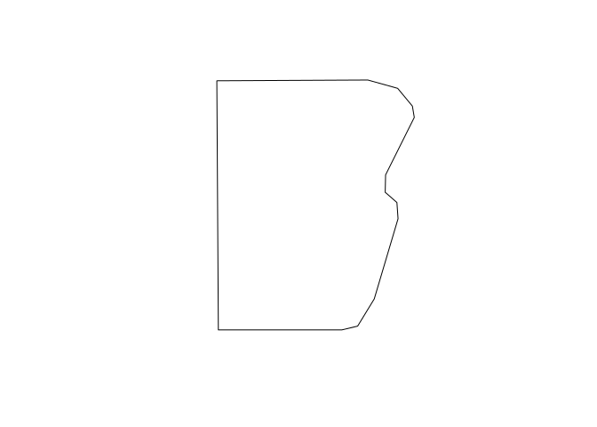

Summer Heat at the University of Montana
================
Marie Johnson
10/20/2022

## Objective

In this code we will explore summer land surface temperatures (LST) at
the University of Montana (UMT) using ECOSTRESS LST data. We’ll find the
best places to stay cool in the summer on campus! \#\# Libraries we will
use:

``` r
knitr::opts_chunk$set(echo = TRUE)
knitr::opts_chunk$set(root.dir = '/home/marie/portfolio/UM')
```

``` r
library(raster)
```

    ## Loading required package: sp

``` r
library(tidyverse)
```

    ## ── Attaching packages ─────────────────────────────────────── tidyverse 1.3.0 ──

    ## ✓ ggplot2 3.3.5     ✓ purrr   0.3.4
    ## ✓ tibble  3.0.4     ✓ dplyr   1.0.4
    ## ✓ tidyr   1.1.2     ✓ stringr 1.4.0
    ## ✓ readr   1.4.0     ✓ forcats 0.5.0

    ## ── Conflicts ────────────────────────────────────────── tidyverse_conflicts() ──
    ## x tidyr::extract() masks raster::extract()
    ## x dplyr::filter()  masks stats::filter()
    ## x dplyr::lag()     masks stats::lag()
    ## x dplyr::select()  masks raster::select()

``` r
library(lubridate)
```

    ## 
    ## Attaching package: 'lubridate'

    ## The following objects are masked from 'package:raster':
    ## 
    ##     intersect, union

    ## The following objects are masked from 'package:base':
    ## 
    ##     date, intersect, setdiff, union

``` r
# Import LST files
summerList <- list.files(path='/home/marie/portfolio/UM/LST/summer', full.names = T) # Raw LST file list
umShp <- shapefile('umt.shp')
```

## Including Plots

You can also embed plots, for example:

``` r
plot(umShp)
```

<!-- -->

Note that the `echo = FALSE` parameter was added to the code chunk to
prevent printing of the R code that generated the plot.
