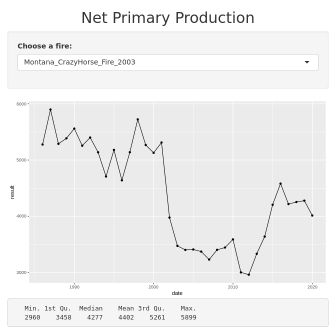

fireNPP
================
Marie Johnson
11/11/2022

``` r
knitr::opts_chunk$set(echo = TRUE)
knitr::opts_chunk$set(message = FALSE)
# knitr::opts_chunk$set(warning = FALSE)
knitr::opts_chunk$set(root.dir = '/home/marie/portfolio')
knitr::opts_knit$set(root.dir = "/home/marie/portfolio")
```

``` r
# Libraries ---------------------------------------------------------------
# Install required packages if needed
# install.packages(c("shiny", "dplyr", "ggplot2"))
library(shiny)
library(dplyr)
library(ggplot2)
```

``` r
ch <- read.csv("fireApp/crazyHorse2003.csv") 
crazyHorse2 <- as.data.frame(ch)
crazyHorse2$Year <- c(1986:2020)

crazyHorse <- data.frame(date=crazyHorse2$Year, 
                         value_name = rep("Montana_CrazyHorse_Fire_2003", 35),
                         result=crazyHorse2$value)
rim13 <- read.csv("fireApp/rim2013.csv")
rim2 <- as.data.frame(rim13)
rim2$Year <- c(1986:2020)

rim <- data.frame(date=rim2$Year, 
                  value_name = rep("California_Rim_Fire_2013", 35),
                  result=rim2$value)
wl <- read.csv("fireApp/wallow2011.csv")
wl$Year <- c(1986:2020)
wallow <- data.frame(date=wl$Year, 
                     value_name = rep("Arizona_Wallow_Fire_2011", 35),
                     result=wl$value)

nm <- read.csv("fireApp/NM3338210781720030704_2003.csv")
nm$Year <- c(1986:2020)
nmFire <- data.frame(date=nm$Year, 
                     value_name = rep("NewMexico_Unnamed_Fire_2003", 35),
                     result=nm$value)

vl <- read.csv("fireApp/valley2015.csv")
vl$Year <- c(1986:2020)
valley <- data.frame(date=vl$Year, 
                     value_name = rep("California_Valley_Fire_2015", 35),
                     result=vl$value)

br <- read.csv("fireApp/bear2006.csv")
br$Year <- c(1986:2020)
bear <- data.frame(date=br$Year, 
                   value_name = rep("NewMexico_Bear_Fire_2006", 35),
                   result=br$value)

bc <- read.csv("fireApp/biscuit2002.csv")
bc$Year <- c(1986:2020)
biscuit <- data.frame(date=bc$Year, 
                      value_name = rep("Oregon_Biscuit_Fire_2002", 35),
                      result=bc$value)

stack_data <- rbind(crazyHorse, rim, wallow, nmFire, valley, bear, biscuit)
```

<!-- -->
